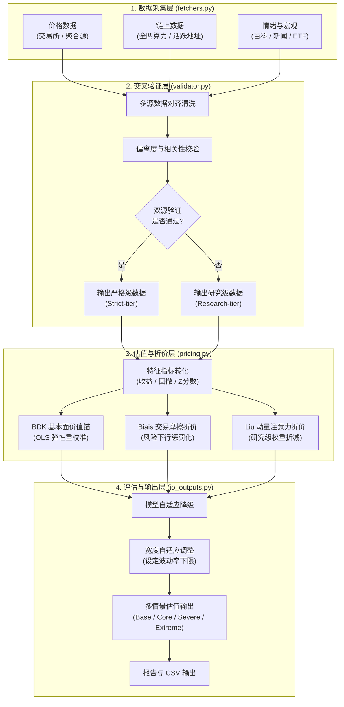

# 比特币多维动态定价与级联估值框架 (QuantStrat)

本项目提供了一个基于学术理论的**比特币（BTC）统一多维动态下沿估值模型**。模型融合了链上核心基本面锚定与市场行为折价机制，旨在极端行情或高波动市场下，为比特币计算出具有坚实基本面支撑、且经过市场情绪与交易摩擦调整的价格下沿支撑区间。

模型基于三篇顶级金融学与经济学学术论文构建核心定价算法：
1. **Bhambhwani et al. (2019, BDK)** — 链上基本面与网络价值锚定
2. **Biais et al. (2023)** — 均衡交易便利收益与成本折价层
3. **Liu and Tsyvinski (2021)** — 动量与投资者注意力风险收益折价层

---

## 1. 级联定价体系 (Cascade Pricing System)

模型采用**“基本面价值锚 + 双重行为折价”**的级联结构：

$$
P_{strict} = V_{BDK} \times D_{Biais} \times D_{Liu}
$$

$$
\text{Valuation Range} = P_{strict} \times (1 \pm W)
$$

### 1.1 系统工作流与数据级联


---

## 2. 核心定价算法与学术源起

### 2.1 BDK 链上基本面价值锚 (V_BDK)
基于 BDK (2019) 论文，利用算力 (HR) 与活跃地址 (AA) 锚定比特币的生产力与网络效应。

1. **长期 Log-Log 公允估值模型**：

$$
\log(P) = \alpha + \beta_{hr}\log(HR) + \beta_{net}\log(AA) + \epsilon
$$

* **动态样本内重校准**：模型支持在当前验证样本内自动进行 OLS 二元回归。若估计的弹性系数均为正值，则动态采用最新样本内弹性；否则回退至经典历史弹性（算力弹性 1.298，活跃地址弹性 1.802）。

2. **压力情景锚定公式**：

$$
V_{BDK} = P_{current} \times \left(\frac{HR_{stress}}{HR_{current}}\right)^{\beta_{hr}} \times \left(\frac{AA_{stress}}{AA_{current}}\right)^{\beta_{net}}
$$

> [!IMPORTANT]
> 为避免重复计算，Biais 与 Liu 折价层中**禁用了 Active Addresses**，仅在 BDK 层计算网络效应。

---

### 2.2 Biais 均衡交易折价算法 (D_Biais)
评估网络交易的实际便利收益与系统摩擦。计算四大因子的滚动 Z-Score 并进行动态加权，生成 $S_{Biais}$ 综合评分：

$$
S_{Biais} = w_1 Z_{Benefit} + w_2 Z_{Cost} + w_3 Z_{Access} + w_4 Z_{Crash}
$$

* **指标与权重设定**：
  * **交易收益 (Benefit, 40%)**：交易笔数与转账金额均值，反映网络流转能力。
  * **交易成本 (Cost, 20%)**：链上平均手续费（取负值），结合转账量大小复合计算，代表网络摩擦阻力。
  * **市场渠道 (Access, 20%)**：现货 ETF 资金净流入量，体现合规资本流动性输入。
  * **崩盘风险 (Crash, 20%)**：波动率与最大回撤的加权负 Z-Score。整体引入 `clip(upper=0.0)` 处理，使其仅作为下行惩罚项，过滤牛市高位伪正向评分。

---

### 2.3 Liu-Tsyvinski 动量与注意力折价算法 (D_Liu)
刻画市场短期趋势惯性与投资者注意力的非对称溢价。生成 $S_{Liu}$ 评分：

$$
S_{Liu} = w_1' Z_{Momentum} + w_2' Z_{Attention} + w_3' Z_{NegAttention} + w_4' Z_{Activity}
$$

* **指标与权重设定**：
  * **市场动量 (Momentum, 40%)**：7D / 14D / 28D 比特币对数收益率的均值。
  * **普通注意力 (Attention, 25%)**：维基百科页面浏览量滚动 Z-Score。若注意力指标未通过双源严格验证，将被归入 `Research-tier` 并对权重乘以折减因子 `research_tier_weight_factor = 0.60`。
  * **负面注意力 (NegAttention, 20%)**：负面词条（如 bubble/scalability）浏览占比（取负值）。作为 `Research-tier` 时权重同样按 0.60 折减。
  * **活跃增长 (Activity, 15%)**：交易笔数 7D 变化率。

---

### 2.4 折价函数与平滑映射
支持两种折价映射方式（可在配置中指定 `discount_method`）：
* **连续指数折价 (`exponential_downside`，默认)**：

$$
D = \max\left(\text{Floor}, \exp\left(\lambda \cdot \min(S, 0)\right)\right)
$$

  仅在得分为负时触发连续平滑的下行折价，避免临界点跳跃。
* **阶梯阈值折价 (`threshold`)**：根据得分区间离散映射为固定折扣分档。

---

## 3. 自适应状态评估与宽度调整机制

1. **学术语义状态 (Model Status) 与基准区间宽度 (W)**:
   * `Full Model`：三大模块均通过严格多源验证（$W = 0.05$）。
   * `BDK + Biais Core + Liu Attention Enhanced`：注意力增强的混合模型（$W = 0.10$）。
   * `BDK + Biais Core + Liu Momentum` / `BDK + Liu Full`：包含部分折价或经典动量（$W = 0.10 \sim 0.12$）。
   * `BDK + Biais Core` / `BDK + Liu Attention Enhanced` / `BDK + Liu Momentum`：单折价层模型（$W = 0.15$）。
   * `BDK Only`：仅保留链上基本面价值锚（$W = 0.18$）。

2. **样本缺失宽度惩罚**：
   为对冲计算窗口内有效样本不足的风险，若核心验证指标天数偏低，将自动追加区间宽度：
   * 当 `min_core_validated_obs` < 60 天时：区间宽度追加 $+0.05$。
   * 当 60 天 $\le$ `min_core_validated_obs` < 90 天时：区间宽度追加 $+0.03$。

3. **区间波动率下限限制**：
   为避免估值区间过窄而脱离现实，设定硬性下限 `band_width_floor = 0.12`。最终的区间宽度限制在 0.12 至 0.30 之间。

---

## 4. 压力情景体系设计

模型基于链上数据历史分布，设计了四类不同强度的左侧压力情景：

| 情景名称 (Scenario) | 算力与活跃地址压力目标 | 物理含义 |
| :--- | :--- | :--- |
| **基础压力 (Base)** | 回落至窗口期 30% 分位数，上限为当前值的 98% | 模拟常规熊市底部的链上收缩状态 |
| **核心下沿 (Core)** | 回落至窗口期 15% 分位数，上限为当前值的 95% | **建议的常规左侧建仓参考下沿** |
| **严重压力 (Severe)** | 回落至窗口期 5% 分位数，上限为当前值的 90% | 行业发生重大负面事件时的深度收缩状态 |
| **极端尾部 (Extreme)** | 回落至窗口期 5% 分位数，上限为当前值的 85% | 模拟极限恐慌与黑天鹅底部的价格支撑 |

---

## 5. 使用与运行指南

### 5.1 快速运行
```bash
# 安装依赖
pip install -r requirements.txt

# 运行模型
python btc_unified_pricing_model_v1_3.py --days 180 --output-dir ./btc_pricing_output_v1_3
```

### 5.2 命令行常用参数
* `--config`: 指定外部 JSON/YAML 配置文件路径。
* `--days`: 设定历史对齐与计算的时间窗口天数（默认 180 天）。
* `--skip-gdelt` / `--skip-etf`: 跳过爬取 GDELT 负面新闻或 ETF 数据。
* `--fast`: 快速诊断模式（自动跳过 GDELT/ETF 并缩短超时，适用于快速测试）。

### 5.3 配置文件示例 (`config.json`)
```json
{
  "days": 180,
  "output_dir": "./btc_pricing_output_v1_3",
  "beta_recalibrate_in_sample": true,
  "discount_method": "exponential_downside",
  "band_width_floor": 0.12,
  "research_tier_weight_factor": 0.60
}
```
