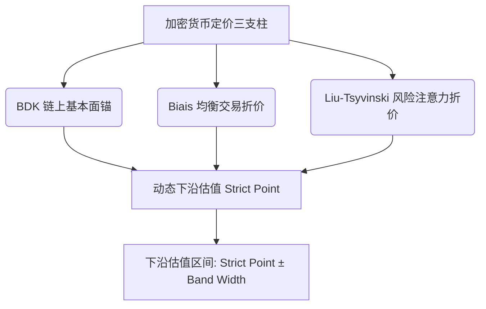

# 比特币统一多维定价与算法模型 (QuantStrat)

本项目实现并优化了一个**比特币（BTC）统一多维动态下沿估值模型**。模型融合了链上核心基本面锚定与市场行为折价机制，基于三篇顶尖学术论文构建核心定价算法：

1. **Bhambhwani, Delikouras, and Korniotis (2019)** — 链上基本面与网络价值锚定
2. **Biais et al. (2023)** — 均衡交易便利收益与成本折价层
3. **Liu and Tsyvinski (2021)** — 动量与注意力风险收益折价层

---

## 1. 核心定价算法与级联框架

模型采用**“基本面价值锚 + 双重行为折价”**的级联定价结构：

$$\text{Strict Valuation Point} = \text{BDK Fundamental Anchor} \times \text{Biais Discount} \times \text{Liu-Tsyvinski Discount}$$



### 1.1 BDK 链上基本面价值锚 (Bhambhwani et al., 2019)
通过算力（Hashrate）与网络规模（Active Addresses）锚定比特币的底层生产力与网络价值。在设定算力与用户规模回落的压力情景时，基本面锚定价值计算公式为：

$$V_{\text{BDK}} = P_{\text{current}} \times \left(\frac{\text{HR}_{\text{stress}}}{\text{HR}_{\text{current}}}\right)^{\beta_{\text{hr}}} \times \left(\frac{\text{AA}_{\text{stress}}}{\text{AA}_{\text{current}}}\right)^{\beta_{\text{net}}}$$

*   **算力弹性系数** $\beta_{\text{hr}} = 1.298$，刻画算力下行对网络信任与安全边际的冲击。
*   **活跃地址弹性系数** $\beta_{\text{net}} = 1.802$，刻画网络效应与梅特卡夫定律（Metcalfe's Law）对资产估值的缩减效应。

---

### 1.2 Biais 均衡收益折价算法 (Biais et al., 2023)
评估网络交易的实际效益与均衡风险。通过计算四大因子滚动 $Z$-Score 并进行动态加权，生成 $S_{\text{Biais}}$ 评分：

$$S_{\text{Biais}} = w_1 \cdot Z_{\text{Benefit}} + w_2 \cdot Z_{\text{Cost}} + w_3 \cdot Z_{\text{Access}} + w_4 \cdot Z_{\text{Crash}}$$

| 评估维度 (Dimension) | 因子 ($Z$-Score) | 代理指标 (Proxy Metric) | 权重 ($w$) | 物理含义 (Meaning) |
| :--- | :---: | :--- | :---: | :--- |
| **交易收益** (Benefit) | $Z_{\text{Benefit}}$ | 交易笔数与转账金额的均值 | **40%** | 比特币网络的实际使用效用与转移价值能力 |
| **交易成本** (Cost) | $Z_{\text{Cost}}$ | 链上平均手续费（取负数） | **20%** | 网络拥堵情况与链上摩擦阻力带来的负反馈 |
| **市场渠道** (Access) | $Z_{\text{Access}}$ | 比特币 ETF 资金净流入量 | **20%** | 传统金融机构与合规资本的准入通道度 |
| **崩盘风险** (Crash) | $Z_{\text{Crash}}$ | 滚动实现波动率与最大回撤（取负数） | **20%** | 市场极端波动与下行抛压带来的避险折扣 |

通过 $S_{\text{Biais}}$ 划分阶梯阈值映射出折价因子（如通过得分映射为 `0.92` 的折价系数，未通过则返回 `1.0` 无折扣）。

---

### 1.3 Liu-Tsyvinski 动量与注意力折价算法 (Liu & Tsyvinski, 2021)
评估市场动量与投资者注意力的非对称溢价。通过对四大行为因子进行动态加权，生成 $S_{\text{Liu}}$ 评分：

$$S_{\text{Liu}} = w_1' \cdot Z_{\text{Momentum}} + w_2' \cdot Z_{\text{Attention}} + w_3' \cdot Z_{\text{Neg Attention}} + w_4' \cdot Z_{\text{Activity}}$$

| 评估维度 (Dimension) | 因子 ($Z$-Score) | 代理指标 (Proxy Metric) | 权重 ($w'$) | 物理含义 (Meaning) |
| :--- | :---: | :--- | :---: | :--- |
| **市场动量** (Momentum) | $Z_{\text{Momentum}}$ | 7D/14D/28D 比特币对数收益率均值 | **40%** | 价格趋势强弱及短期趋势的反转状态 |
| **普通注意力** (Attention) | $Z_{\text{Attention}}$ | 维基百科页面浏览量滚动均值 | **25%** | 散户与大众投资者的关注度与投机热度共识 |
| **负面注意力** (Neg Attention) | $Z_{\text{Neg Attention}}$ | 负向话题（泡沫/扩容等）访问量占比（取负数）| **20%** | 市场对负面事件（恐慌/政策等）的警惕防备度 |
| **活跃增长** (Activity) | $Z_{\text{Activity}}$ | 网络交易笔数或交易量的 7D 变化率 | **15%** | 实体经济活跃度的动态成长与增长势头 |

通过 $S_{\text{Liu}}$ 划分阶梯阈值映射出折价因子（如通过得分映射为 `0.95` 的折价系数，未通过则返回 `1.0` 无折扣）。

---

## 2. 动态定价降级与区间宽度算法

模型根据数据源的验证结果，设计了**动态定价降级（Model Downgrade）**与**区间宽度惩罚（Band Width Penalty）**机制：

```text
定价层级 (Model Status) ───► Full Model (0.05 极窄宽度) ───► Core Model (0.10 较窄) ───► BDK Only (0.18 较宽)
                               ▲                                ▲
                               │                                │
                           数据充足                         部分缺失惩罚 (追加 0.03 ~ 0.05 宽度)
```

1.  **定价层级分类**：
    *   **Full Model**：核心锚与双折价层全通过，采用最窄区间宽度基准 $\text{Band Width} = 0.05$。
    *   **Core / Reduced Model**：仅核心基本面锚与任一折价模块通过，区间宽度基准放宽至 $0.10 \sim 0.15$。
    *   **BDK Only**：仅基本面锚有效，折价层校验失效，使用较宽区间基准 $0.18$。
2.  **样本缺失惩罚**：若核心变量有效观测天数小于 90 天，对区间宽度追加惩罚项 $\text{Width Addon} = 0.03 \sim 0.05$，最终下沿区间公式为：
    
$$\text{Price Range} = \text{Strict Point} \times (1 \pm \text{Band Width})$$

### 2.1 Strict / Research 双层入模优化

为避免 Biais 与 Liu-Tsyvinski 行为折价层因代理变量天然口径差异而被系统性剔除，模型保留 BDK 核心变量的严格交叉验证，同时允许行为层使用带 `validation_tier` 标记的研究级代理入模：

* **BDK 核心锚**：价格、算力、活跃地址仍必须通过严格多源验证。
* **Biais Core**：交易便利收益与崩盘风险为核心，ETF flow 作为市场准入扩展项，缺失时不阻断 Biais 核心折价层。
* **Liu-Tsyvinski**：支持 `momentum-only` 低置信折价；若普通注意力或负面注意力通过 strict/research 代理验证，则升级为 `attention-enhanced`。
* **输出检验**：新增 `btc_three_paper_framework_pricing_v1_3.csv`，用于直接检查 BDK anchor、Biais/Liu score、折价系数、入模模块与估值区间。

---

## 3. 定价情景设计

模型依据不同链上压力级别，设计了四大估值下沿情景：
1.  **基础压力 (Base)**：算力与活跃地址回落到最近观测样本的 30% 分位数。
2.  **核心下沿 (Core)**：算力与活跃地址回落到最近观测样本的 15% 分位数。
3.  **严重压力 (Severe)**：算力与活跃地址回落到最近观测样本的 5% 分位数。
4.  **极端尾部 (Extreme)**：在 5% 分位数基础上进一步下压，模拟极限恐慌状态下的价格底部。

---

## 4. 项目模块与代码目录

*   `btc_unified_pricing_model/`
    *   `pricing.py`：**【核心定价算法与估值逻辑】**实现基本面锚定公式、Biais 评分加权、Liu-Tsyvinski 评分加权以及四类压力情景下的区间输出。
    *   `validator.py`：负责学术共识交叉验证（过滤未经验证的数据，确保定价入参的数据可信度）。
    *   `processor.py`：执行特征转换（对数收益、注意力 Ratio 等）。
    *   `pipeline.py` / `cli.py`：串联整个定价计算工作流。
