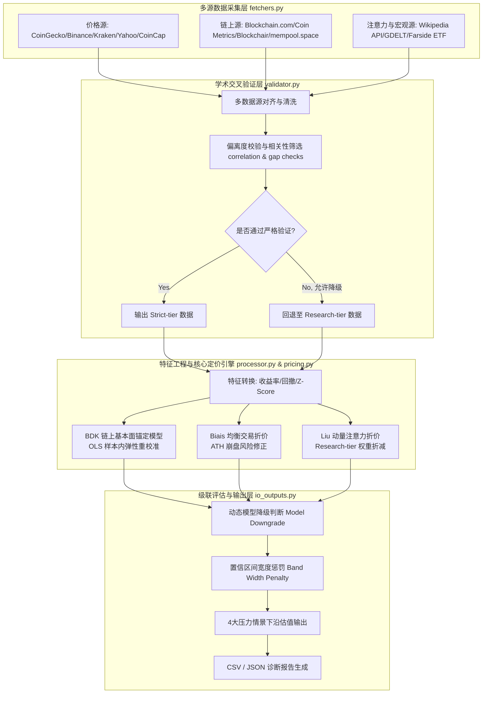

# 比特币统一多维定价与算法模型 (QuantStrat) v1.3

本项目实现并优化了一个**比特币（BTC）统一多维动态下沿估值模型**。该模型将顶级金融学术理论转化为工程化量化策略，旨在极端行情或高波动市场中，为比特币计算出一个具有坚实基本面支撑、且经过市场情绪与交易摩擦折价处理的**绝对价格下限（Strict Lower Point / Bound）**。

模型融合了以下三篇顶尖学术论文的核心定价逻辑与实证发现：
1. **Bhambhwani, Delikouras, and Korniotis (2019, BDK)** — 链上基本面与网络价值锚定
2. **Biais et al. (2023)** — 均衡交易便利收益与成本折价层
3. **Liu and Tsyvinski (2021)** — 动量与投资者注意力风险收益折价层

---

## 1. 级联式下沿估值框架 (Cascade Pricing Framework)

模型采用**“基本面价值锚 + 双重行为折价”**的级联定价结构。首先通过链上硬性指标确定底座价值，再利用网络交易状态与市场情绪动量进行惩罚性打折，最终输出包含置信区间的下沿价格范围。

### 1.1 级联定价公式
$$\text{Strict Lower Point} = \text{BDK Stress Anchor} \times \text{Biais Discount} \times \text{Liu-Tsyvinski Discount}$$

$$\text{Valuation Range} = \text{Strict Lower Point} \times (1 \pm \text{Band Width})$$

### 1.2 系统工作流与数据级联


---

## 2. 核心定价模块与学术理论应用

### 2.1 BDK 链上基本面价值锚 (Bhambhwani et al., 2019)
BDK 模块通过**算力（Hashrate）**与**网络规模（Active Addresses）**刻画比特币的底层生产力与网络效应。

1. **长期 Log-Log 基准模型**：
   $$\log(P) = \alpha + \beta_{\text{hr}}\log(\text{HR}) + \beta_{\text{net}}\log(\text{AA}) + \epsilon$$
   * **纸面历史参数**：算力弹性 $\beta_{\text{hr}} = 1.298$，活跃地址弹性 $\beta_{\text{net}} = 1.802$（基于 2013-2018 年数据）。
   * **OLS 样本内重校准（v1.3 升级）**：由于比特币已进入机构化与 ETF 时代，历史参数存在断点漂移。v1.3 支持在当前验证样本内自动进行 OLS 二元回归。只有当估计出的两项弹性系数均为正值时，才会采用最新的样本内弹性参数，否则回退至纸面历史参数。截距项 $\alpha$ 一律使用 OLS 均值残差计算，以保障模型的一致性。

2. **压力情景锚定公式**：
   $$V_{\text{BDK}} = P_{\text{current}} \times \left(\frac{\text{HR}_{\text{stress}}}{\text{HR}_{\text{current}}}\right)^{\beta_{\text{hr\_used}}} \times \left(\frac{\text{AA}_{\text{stress}}}{\text{AA}_{\text{current}}}\right)^{\beta_{\text{net\_used}}}$$
   在链上数据回落的预设压力场景下，计算比特币对应的基本面支撑底价。

> [!NOTE]
> 为避免指标重复计算导致过度折价，模型在后两篇论文的行为折价层中**禁用了 Active Addresses**，将其作为 BDK 网络效应的专有代理变量。

---

### 2.2 Biais 均衡交易折价算法 (Biais et al., 2023)
该层评估网络交易的实际便利收益与系统摩擦。通过计算四个维度因子的滚动 $Z$-Score 并进行动态加权，生成 $S_{\text{Biais}}$ 评分：

$$S_{\text{Biais}} = w_1 \cdot Z_{\text{Benefit}} + w_2 \cdot Z_{\text{Cost}} + w_3 \cdot Z_{\text{Access}} + w_4 \cdot Z_{\text{Crash\_Risk}}$$

| 评估维度 (Dimension) | 代理指标 (Proxy Metric) | 默认权重 | 优化与物理含义 |
| :--- | :--- | :---: | :--- |
| **交易收益** (Benefit) | 交易笔数与链上转账金额（USD）的 Z-Score 均值 | **40%** | 网络实际使用效用与价值流转能力 |
| **交易成本** (Cost) | 链上平均手续费（取负值），并引入转账金额对冲 | **20%** | 网络拥堵带来的摩擦阻力。结合转账量判断，避免低活跃度低费用的误判 |
| **市场渠道** (Access) | 比特币 ETF 资金净流入量（如 Farside） | **20%** | 传统金融准入通道与合规资本的流动性输入 |
| **崩盘风险** (Crash) | 滚动实现波动率与最大回撤的加权负 Z-Score | **20%** | **ATH 修正**：牛市顶部（如历史新高无回撤时）Z-Score 极低导致伪正向评分。v1.3 对此组分整体进行 `clip(upper=0.0)` 处理，使其仅作下行惩罚项 |

---

### 2.3 Liu-Tsyvinski 动量与注意力折价算法 (Liu & Tsyvinski, 2021)
该层刻画市场短期趋势反转及投资者关注度的非对称溢价。生成 $S_{\text{Liu}}$ 评分：

$$S_{\text{Liu}} = w_1' \cdot Z_{\text{Momentum}} + w_2' \cdot Z_{\text{Attention}} + w_3' \cdot Z_{\text{Neg\_Attention}} + w_4' \cdot Z_{\text{Activity\_Growth}}$$

| 评估维度 (Dimension) | 代理指标 (Proxy Metric) | 默认权重 | 优化与物理含义 |
| :--- | :--- | :---: | :--- |
| **市场动量** (Momentum) | 7D / 14D / 28D 比特币对数收益率的均值 | **40%** | 价格趋势强弱及短期惯性反转状态 |
| **普通注意力** (Attention) | 维基百科页面浏览量滚动 Z-Score | **25%** | **置信度打折**：若未通过双源严格验证而使用单源 Wikipedia 等 `Research-tier` 数据，该分量权重将按 `research_tier_weight_factor = 0.60` 折减 |
| **负面注意力** (Neg Attention) | 维基百科负面词条（如 bubble/scalability）浏览占比 | **20%** | **置信度打折**：负面关注度取反。若为 `Research-tier` 数据，权重同样进行 0.60 折减 |
| **活跃增长** (Activity) | 链上交易笔数 7D 变化率 | **15%** | 实体经济活跃度的短期动态成长势头 |

---

### 2.4 折价函数选择
项目支持两种折扣映射方法（可在配置中指定 `discount_method`）：
1. **连续指数折价（`exponential_downside`，默认）**：
   $$\text{Discount} = \max\left(\text{Floor}, \exp\left(\lambda \times \min(S, 0)\right)\right)$$
   仅在分数为负（即基本面/情绪恶化）时触发连续平滑的下行折价，避免了阶梯阈值在分界点处的跳跃，更符合市场运行逻辑。
2. **阶梯阈值折价（`threshold`）**：
   根据得分落入的区间离散映射为固定折扣（例如 $S < -0.5$ 映射为 `0.92` 等）。

---

## 3. 动态降级与区间宽度调整机制

为应对现实中免费/公开 API 频繁限频或缺失的问题，模型设计了严密的数据容错与自适应调整系统：

```text
模型状态等级 ───► Full Model (0.12 宽度下限) ───► Core Model (0.10~0.15) ───► BDK Only (0.18 宽度)
                         ▲                               ▲
                         │                               │
                      数据完备                        数据缺失惩罚 (追加 0.03 ~ 0.05 宽度)
```

1. **模型语义状态（Model Status）**：
   根据实际入模且通过验证的模块，将模型划分为 6 类清晰的学术状态，并分配不同的基准区间宽度（`band_width`）：
   * `Full Model`：三大模块完整通过验证（基准宽度：$0.05$）。
   * `BDK + Biais Core + Liu Attention Enhanced`：注意力增强的混合模型（基准宽度：$0.10$）。
   * `BDK + Biais Core + Liu Momentum` / `BDK + Liu Full`：部分折价或仅含动量模型（基准宽度：$0.10 \sim 0.12$）。
   * `BDK + Biais Core` / `BDK + Liu Attention Enhanced` / `BDK + Liu Momentum`：单折价层模型（基准宽度：$0.15$）。
   * `BDK Only`：折价层全部失效，仅保留链上基本面价值锚（基准宽度：$0.18$）。

2. **样本缺失宽度惩罚**：
   为防止计算窗口内有效样本过少导致定价失真，若核心变量（Price/HR/AA）在计算窗口内的有效验证天数较少，将对区间宽度追加惩罚：
   * $\text{min\_core\_validated\_obs} < 60 \text{ 天}$：追加 $\Delta w = 0.05$
   * $60 \text{ 天} \le \text{min\_core\_validated\_obs} < 90 \text{ 天}$：追加 $\Delta w = 0.03$

3. **区间波动率下限限制（Band Width Floor）**：
   考虑到比特币历史月度波动率通常在 20%~40% 之间，区间过窄（例如 $\pm5\%$）会导致统计精度不切实际。v1.3 引入了硬性下限 `band_width_floor = 0.12`，确保最终的价格区间宽度符合资产的天然波动属性。

---

## 4. 压力情景体系设计

模型基于链上数据历史分布，设计了四类具有实战参考价值的估值下沿情景：

| 情景名称 (Scenario) | 算力与活跃地址压力目标 | 物理含义与出模设定 |
| :--- | :--- | :--- |
| **基础压力 (Base)** | 回落至窗口期 30% 分位数，上限为当前值的 98% | 常规熊市底部的链上活跃度与算力收缩状态 |
| **核心下沿 (Core)** | 回落至窗口期 15% 分位数，上限为当前值的 95% | **模型主力下沿参考**，对应中度链上危机 |
| **严重压力 (Severe)** | 回落至窗口期 5% 分位数，上限为当前值的 90% | 对应行业重大负面事件（如监管收紧或矿工大面积断电） |
| **极端尾部 (Extreme)** | 回落至窗口期 5% 分位数，上限为当前值的 85% | **v1.3 修正**：去除旧版双重下行惩罚（剔除乘以 0.9 逻辑），纯粹模拟极端市场恐慌与极限抛压底 |

---

## 5. 项目模块与代码目录

* `btc_unified_pricing_model/`
  * `config.py`：模型核心参数 dataclass（包含弹性系数、平滑窗口、Z-Score 阈值等）。
  * `config_loader.py`：加载本地 JSON/YAML 配置文件并合并命令行覆盖参数。
  * `fetchers.py`：多源数据自动抓取器。集成了 CoinGecko, Binance, Kraken, Blockchain.com, Coin Metrics, Blockchair, Wikipedia 等 API，设计了强健的级联备用链（Fallback chain）。
  * `validator.py`：学术级交叉验证引擎。通过偏离度、相关性、重叠窗口 Spearman 秩相关系数等，对各数据源进行横向校验。
  * `processor.py`：特征工程处理器，对对数收益率、波动率、最大回撤及 Z-Score 等指标进行计算与对齐。
  * `pricing.py`：核心定价引擎，包含 BDK OLS 回归、折价计算、连续映射、区间惩罚及四大场景级联运算。
  * `health.py`：健康跟踪器，记录各个数据源的请求成功率、延迟、数据完整性并生成健康报告。
  * `io_outputs.py`：将计算完成的数据转化为结构化的 JSON/CSV 报告。
  * `pipeline.py` / `cli.py`：串联整个计算工作流的入口与命令行接口。
* `tests/`：单元测试模块，对各个逻辑、校准、折价连续性等进行校验。
* `example_outputs/`：包含最新的历史定价输出样本（如 [btc_three_paper_framework_pricing_v1_3.csv](file:///c:/Users/78432/OneDrive/桌面/QuantStrat/Crypto_Pricing—— 加密货币定价/example_outputs/btc_three_paper_framework_pricing_v1_3.csv)）。

---

## 6. 运行指南

### 6.1 安装依赖
确保安装了 Python 3.9+，并在项目根目录下安装相关依赖：
```bash
pip install -r requirements.txt
```

### 6.2 快速运行
直接运行 CLI 包装器进行回测与估值计算：
```bash
python btc_unified_pricing_model_v1_3.py --days 180 --output-dir ./btc_pricing_output_v1_3
```

### 6.3 命令行常用参数
* `--config`: 指定本地 JSON/YAML 配置文件路径。
* `--days`: 设定回测与数据对齐的时间窗口天数（默认 180 天）。
* `--skip-gdelt`: 跳过 GDELT 新闻注意力的网络爬取，以加快计算速度。
* `--skip-etf`: 跳过 Farside ETF 净流入数据的爬取。
* `--fast`: 快速诊断模式（自动跳过 GDELT/ETF 抓取，降低超时阈值与重试次数）。
* `--manual-google-trends-csv`: 提供诊断用的本地手动 Google Trends 数据。

### 6.4 配置文件示例 (`config.json`)
可以通过提供本地配置文件微调模型参数：
```json
{
  "days": 180,
  "output_dir": "./btc_pricing_output_v1_3",
  "beta_recalibrate_in_sample": true,
  "discount_method": "exponential_downside",
  "band_width_floor": 0.12,
  "research_tier_weight_factor": 0.60
}
```

---

## 7. v1.3 版本核心优化项说明

在最近的系统性审计与优化中，v1.3 版本对模型的数学缺陷与逻辑漏洞进行了彻底修复：

```diff
- 1. BDK 基本面弹性系数完全硬编码，且伪回归截距采用中位数
+ 1. 新增 beta_recalibrate_in_sample 选项，支持 OLS 样本内弹性重校准，且 alpha 一律用 OLS 均值残差，保持与论文方法论高度统一。
- 2. 牛市顶部无回撤时，Biais 折价层会因 -z_drawdown 为正而产生虚假正向信号
+ 2. 对 Biais 崩盘风险组分整体实施上限 clip(upper=0.0)，使其纯粹作为下行惩罚项，消除了泡水市况下的奖励噪音。
- 3. pandas loc 链式赋值隐患，且在 pandas 高版本中可能静默产生 NaN
+ 3. 将 biais_score 与 liu_score 的累加逻辑完全重构为 numpy 向量化实现，彻底规避链式赋值警告。
- 4. Research-tier（单源维基百科）注意力进入 Liu 折价层时权重与严格双源完全一致，未体现置信度差异
+ 4. 引入 research_tier_weight_factor 对单源注意力权重打折（0.60），拉开置信度梯度。
- 5. 极端尾部情景的 hr_stress 与 aa_stress 乘以 0.90，造成无历史依据的双重下压
+ 5. 移除了 0.90 的二次惩罚，使其客观回归历史 5% 极端分位加封顶限制。
- 6. 定价状态命名使用 Reduced/Core Model，语义模糊
+ 6. 重构为与论文对应的 6 种精确学术语义状态，并将 band_width 最窄处限制在 band_width_floor (0.12) 以上，匹配 BTC 的真实历史波动率。
```
