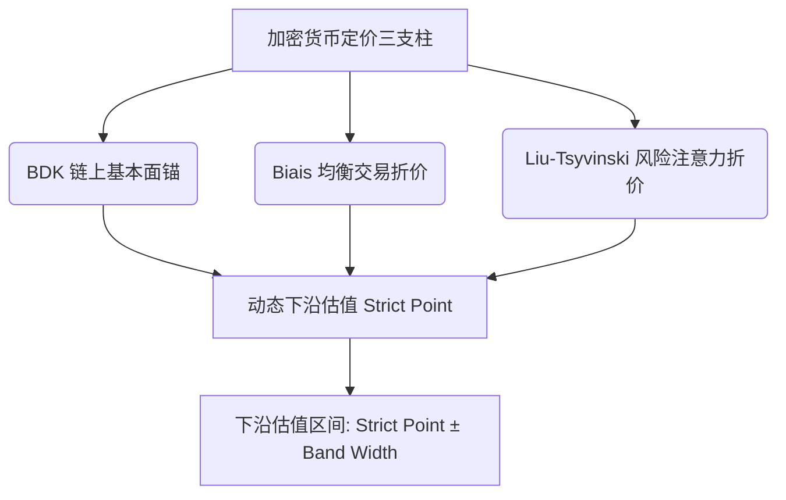

# 比特币统一多维定价与算法模型 (QuantStrat)

本项目致力于实现并优化一个**比特币（BTC）统一多维动态下沿估值模型**。模型融合了链上基本面锚定与行为经济学折价机制，基于三篇顶尖学术论文构建核心定价算法：

1. **Bhambhwani, Delikouras, and Korniotis (2019)** — 链上基本面与网络价值锚定
2. **Biais et al. (2023)** — 均衡交易便利收益与成本折价层
3. **Liu and Tsyvinski (2021)** — 动量与注意力风险收益折价层

---

## 1. 核心定价算法与框架

模型采用**“基本面价值锚 + 双重行为折价”**的级联定价结构：

$$\text{Strict Valuation Point} = \text{BDK Fundamental Anchor} \times \text{Biais Discount} \times \text{Liu-Tsyvinski Discount}$$

### 1.1 BDK 链上基本面价值锚 (Bhambhwani et al., 2019)
通过算力（Hashrate）与网络规模（Active Addresses）锚定比特币的底层生产力与网络价值。在设定算力与用户规模回落的压力情景时，基本面锚定价值计算公式为：

$$V_{\text{BDK}} = P_{\text{current}} \times \left(\frac{\text{HR}_{\text{stress}}}{\text{HR}_{\text{current}}}\right)^{\beta_{\text{hashrate}}} \times \left(\frac{\text{AA}_{\text{stress}}}{\text{AA}_{\text{current}}}\right)^{\beta_{\text{network}}}$$

*   其中 $\beta_{\text{hashrate}} = 1.298$ 刻画算力弹性，$\beta_{\text{network}} = 1.802$ 刻画活跃地址网络效应弹性。

---

### 1.2 Biais 均衡收益折价层 (Biais et al., 2023)
评估网络交易的实际效益与均衡风险。对以下四大因子计算滚动 $Z$-Score 并进行动态加权，生成 $S_{\text{Biais}}$ 评分：

$$S_{\text{Biais}} = w_1 \cdot Z_{\text{Benefit}} + w_2 \cdot Z_{\text{Cost}} + w_3 \cdot Z_{\text{Access}} + w_4 \cdot Z_{\text{Crash}}$$

*   **交易收益 ($Z_{\text{Benefit}}$)**：由交易笔数与转账金额的均值表达（权重 $0.40$）。
*   **交易成本 ($Z_{\text{Cost}}$)**：由链上平均手续费表达（取负数，结合转账量平抑，权重 $0.20$）。
*   **市场渠道 ($Z_{\text{Access}}$)**：由 ETF 资金流表达（权重 $0.20$）。
*   **崩盘风险 ($Z_{\text{Crash}}$)**：由滚动实现波动率与最大回撤表达（取负数，权重 $0.20$）。

通过 $S_{\text{Biais}}$ 划分阶梯阈值，动态输出折价系数（如通过阈值映射为 `0.92` 的折价因子）。

---

### 1.3 Liu-Tsyvinski 动量与注意力折价层 (Liu & Tsyvinski, 2021)
评估市场动量与投资者注意力的非对称溢价。对四大因子进行动态加权，生成 $S_{\text{Liu}}$ 评分：

$$S_{\text{Liu}} = w_1' \cdot Z_{\text{Momentum}} + w_2' \cdot Z_{\text{Attention}} + w_3' \cdot Z_{\text{Neg\_Attention}} + w_4' \cdot Z_{\text{Activity}}$$

*   **市场动量 ($Z_{\text{Momentum}}$)**：由 7D/14D/28D 比特币对数收益率表征（权重 $0.40$）。
*   **普通注意力 ($Z_{\text{Attention}}$)**：由维基百科页面浏览量（表征大众注意力）的滚动 $Z$-Score 刻画（权重 $0.25$）。
*   **负面注意力 ($Z_{\text{Neg\_Attention}}$)**：由负面话题访问量占比（表征市场负向情绪）的滚动 $Z$-Score 刻画（取负数，权重 $0.20$）。
*   **活跃增长 ($Z_{\text{Activity}}$)**：由网络活跃度百分比变化率刻画（权重 $0.15$）。

通过 $S_{\text{Liu}}$ 划分阶梯阈值，动态输出折价系数（如通过阈值映射为 `0.95` 的折价因子）。

---

## 2. 定价模型降级与区间宽度算法

模型引入了基于数据质量与验证状态的**动态定价降级（Model Downgrade）**与**区间宽度调整（Band Width Adjustment）**机制：
*   **模型状态降级**：
    *   **Full Model**：所有模块（BDK + Biais + Liu）全部通过验证，采用最窄区间宽度基准 $\text{Band\_Width} = 0.05$。
    *   **Core / Reduced Model**：仅核心锚与部分扩展模块通过验证，区间宽度基准放宽至 $0.10 \sim 0.15$。
    *   **BDK Only**：仅基本面锚有效，折价层未通过，使用较宽区间基准 $0.18$。
*   **样本缺失惩罚**：有效观测天数小于 90 天时，对区间宽度追加 $0.03 \sim 0.05$ 的惩罚项 $\text{Width\_Addon}$，最终估值下沿区间为：
    
$$\text{Price Range} = \text{Strict Point} \times (1 \pm \text{Band\_Width})$$

---

## 3. 定价情景设计

模型依据不同链上压力级别，设计了四大估值下沿情景：
1.  **基础压力 (Base)**：算力与活跃地址回落到最近观测样本的 30% 分位数。
2.  **核心下沿 (Core)**：算力与活跃地址回落到最近观测样本的 15% 分位数。
3.  **严重压力 (Severe)**：算力与活跃地址回落到最近观测样本的 5% 分位数。
4.  **极端尾部 (Extreme)**：在 5% 分位数基础上进一步下压，模拟极度恐慌状态下的极限价格底部。

---

## 4. 项目模块与代码目录

*   `btc_unified_pricing_model/`
    *   `pricing.py`：**【核心算法所在】**实现基本面锚定公式、Biais 分数计算、Liu-Tsyvinski 分数计算、加权分配以及四类压力情景下的区间输出。
    *   `validator.py`：负责学术共识交叉验证（过滤未经验证的数据，确保定价入参的数据可信度）。
    *   `processor.py`：执行特征转换（对数收益、注意力 Ratio 等）。
    *   `pipeline.py` / `cli.py`：串联整个定价计算工作流。
